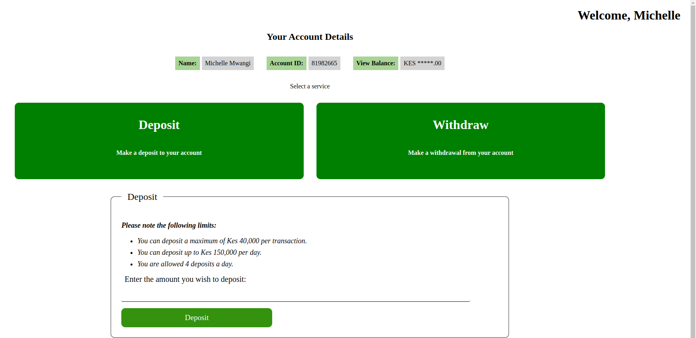
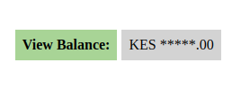
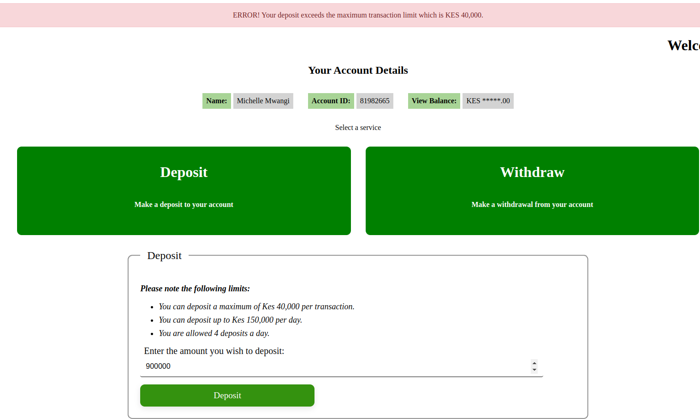

# Bank Account Management System


This project is a simple transaction management web application built with HTML, CSS, and vanilla JavaScript. It allows users to perform deposit and withdrawal transactions within specified limits.

## How to Run the Application

1. **Clone the Repository**

```
git clone git@github.com:michellemwangi01/KonvergenzBankAccount.git
```

2. **Navigate to Project Directory**

```
cd bank_account_konvergenz
```

3. **Start JSON Server**
   To run the application, you'll need to set up a JSON server to serve mock API data. Make sure you have `json-server` installed globally:
   `npm install -g json-server`

   Start the JSON server using the provided `db.json` file:
   `json-server --watch db.json --port 3000`

4. **Open the Application**
   Open the `index.html` in your web browser to access the transaction management application or run using VS code live server.

## Features

- **Deposit and Withdrawal**
- The application implements the `/withdrawal` and `/deposit` endpoints to allow the user to make withdrawals and deposits.
- Users can perform deposit and withdrawal transactions based on specified limits.
- When a withdrawal or deposit is made, the balance is simultaneously also updated.
- The application checks transaction limits retrieved from the JSON server (`/limits`) before processing each transaction.
  

- **Limits**
- The application implements a bonus `/limits` endpoint to allow the limits to be dynamically retrieved from the database.

- **Balance Retrieval**
- Users can retrieve and display their current balance (`/balance`) by clicking the "Display Balance" button.
  

- **Error Handling and Notifications**
- Error messages and notifications are displayed to users based on transaction outcomes and limits.
- Success and failure notifications are displayed for successful transactions.
  

- **Admin Feature: Reset Counts**
- Comes with Admin feature to reset the counts to 0 from the UI bu using an endpoint to reset the deposit and withdrawal counts.

## Code Overview

The application consists of the following components:

- **HTML (`index.html`)**:
- Contains the structure of the application with forms for deposit and withdrawal, balance display, and notification container.

- **CSS (`styles.css`)**:
- Stylesheet defining the appearance and layout of the application components.

- **JavaScript (`script.js`)**:
- Handles API interactions, form submissions, transaction processing, and notification display.
- Implements functions such as `init`, `get_balance`, `get_limits`, `update_balance_and_transaction`, `deposit`, `withdraw`, `displayErrorNotification`, and `displaySuccessNotification`.
- Utilizes `fetch` API for making HTTP requests to the JSON server and `localStorage` for storing and retrieving notification messages.

## Usage Instructions

1. Open the application (`[index.html](http://127.0.0.1:5501/bank_account_konvergenz/index.html)`) in a web browser.
2. Use the "Deposit" or "Withdraw" button to perform transactions.
3. Click the "Get Balance" button to retrieve and display the current balance.
4. Notifications will appear for transaction outcomes and limits.
5. Error messages are displayed for invalid transactions or exceeded limits.
6. Success messages are displayed for successful transactions.

## Notes

- Ensure the JSON server (`json-server`) is running locally on port 3000 before using the application.
- Modify the `db.json` file to adjust transaction limits and mock data as needed for testing purposes.

## Dependencies

- `json-server`: Used to provide a mock REST API for transaction data.
- Web browser with JavaScript support.

---

## Author & License Information

This project was authored by and is licensed to © 2023 MichelleMwangi All rights reserved in partnership with collaborators.
